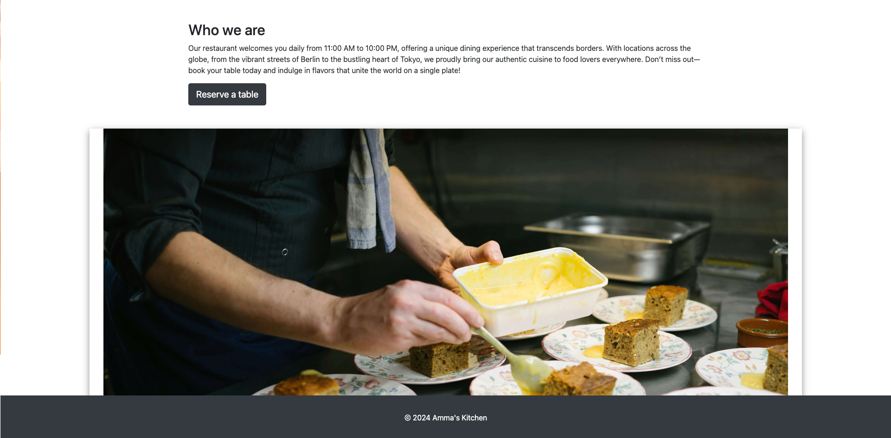

# **Ammas Kitchen - Introduction**

## ***Eat and Enjoy***

Welcome yourself to  *Ammas Kitchen*, also know as **Best restaurant in the world** - a rejoiceful place where you can find the best of both worlds, all on one plate.

Am I Responsive* did not work, but my project is responsive. I haven't found a solution yet.

Amma's Kitchen is a unique fusion restaurant that brings together the rich flavors of European and Asian cuisine. At Amma's Kitchen, we believe in blending culinary traditions to create a dining experience that is both familiar and adventurous. Our chefs meticulously craft each dish, drawing inspiration from diverse cultures and adding a modern twist to time-honored recipes.

From the vibrant streets of Berlin to the bustling markets of Tokyo, our menu offers a journey across continents. Whether you're indulging in a classic European dish with an Asian flair or savoring a traditional Asian meal with a European touch, every bite at Amma's Kitchen is a celebration of flavors. With a cozy, welcoming atmosphere and a commitment to fresh, high-quality ingredients, we invite you to experience the best of both worlds, all on one plate.

Opening Hours:
We are open daily from 11:00 AM to 10:00 PM, ready to serve you an unforgettable culinary experience.

Make a reservation now and discover a new world of flavor at Amma's Kitchen!

View live website here: [ammas kitchen](https://ammas-kitchen-3d49eddc3540.herokuapp.com/).

## **TABLE OF CONTENTS**

- [**Team Goal**](#happy-hackers-team-goal)
- [**Design**](#design)
   * [Colours](#colours)
   * [Typography](#typography)
   * [Wireframes](#wireframes)
   * [Database Schema](#database-schema)
- [**Features**](#features)
  * [Navigation](#navigation)
  * [Footer](#footer)
  * [Home Page](#home-page)
  * [Booking Page](#add-hack-page)
  * [My resevation Page](#hacks-page)
- [**Testing**](#testing)
- [**Bugs**](#bugs)
- [**Technologies Used**](#technology-used)
- [**Credits**](#credits)
- [**The Team**](#the-team)

## **Ammas Kitchen Goals**

- Deliver a unique fusion of European and Asian cuisine
- Provide an exceptional dining experience with innovative dishes
- Use high-quality, fresh ingredients in every meal
- Create a warm and welcoming atmosphere for all guests
- Promote cultural diversity through culinary innovation
- Ensure customer satisfaction with excellent service
- Expand the brand to international markets
- Foster sustainability by using eco-friendly practices
- Build a loyal community of food lovers and regular patrons
- Offer a convenient online reservation system for easy dining

## **DESIGN**

### **Colours**
- Research indicated that the happiest colour was black, with grey also featuring.
- We selcted a serious and professional colour palette to reflect the serious nature of the project.
- Colours were selected using the coolors color palette generator.

### **Typography**
- All fonts were sourced through [Google fonts](https://fonts.google.com/).
- Fonts were selected for their simple and readable design to avoid distracting from the content.
- Roboto Slab and Quicksand were selected.
- Later, Lilita One, was selected for the home page title for impact.

### **Media**
- [Heroku PostSQL](/) was used to sketch out the database models at an early stage.
- [Unsplash](https://unsplash.com/) was used to source the background image.

### **Database Schema**

- The database scheme was completed an an early stage, but later ammended to include emoji's

## **FEATURES**

### **Navigation and Homepage**

### **Homepage**
- Hero Section: Large, visually appealing banner with a background image and a welcoming message (e.g., "Welcome to Amma's Kitchen").
- Call to Action: Prominent "Reserve a Table" button leading to the reservation form.
- Introduction Text: Brief description of Amma's Kitchen, highlighting the fusion of European and Asian cuisine.
- Who We Are Section: Additional section introducing the restaurant's philosophy, cuisine, and unique offerings.
- Image Gallery/Slider (Optional): Showcase of signature dishes and the restaurant's ambiance.
- User-Friendly Navigation: Clear links to important sections like menu, reservations, and contact.
- Mobile-Friendly Design: Responsive layout that adjusts seamlessly to different screen sizes.
- Footer: Contains contact information, social media links, and legal information (e.g., terms, privacy policy).

### **Navigation**
- Logo Placement: Positioned on the left side (or right, based on design preference) to represent Amma's Kitchen branding.
- Responsive Design: Adapts to different screen sizes (desktop, tablet, mobile) with a collapsible hamburger menu for smaller screens.
Menu Items:
- Home: Links to the homepage.
  - Book a Table: Directs users to the reservation form.
  - My Reservations: Allows logged-in users to view and manage their reservations.
  - Login/Logout: Displayed based on user's authentication status (Login if not authenticated, Logout if logged in).
  - Authentication-Dependent Items: Certain menu items (e.g., "My Reservations" or "Logout") are only visible when the user is logged in.
  - Styled with Bootstrap: Uses Bootstrap classes for responsive layout and consistent design.
- Mobile Menu Toggler: A hamburger icon appears on mobile devices to toggle the menu.
- Hover and Active Effects: Menu items highlight when hovered or clicked, making navigation more user-friendly.

### **Footer**
- Located at the bottom of the page the footer loads text with copyright information.

### **Book a table**
- Table Selection: Choose from available tables based on seating capacity and availability.
- Guest Number Input: Field to specify the number of guests, with automatic filtering of tables based on capacity.
- Date and Time Picker: Allows users to select the date and time for their reservation.
- Prevention of Double Booking: System checks to prevent multiple bookings for the same table at the same time.
- Real-Time Availability Check: Ensures that only available tables are shown based on the selected date and time.
- User Authentication: Requires login to complete the booking, ensuring reservations are tied to a user account.
- Confirmation Message: After submitting, users receive confirmation of their booking, with details of the reservation.
- Responsive Design: The booking form is optimized for both desktop and mobile use.

### **My reservation**
- Reservation List: Displays all past and upcoming reservations made by the user.
- Reservation Details: Shows date, time, number of guests, table information, and booking status.
- Cancel Reservation: Provides a "Cancel" button to easily cancel upcoming reservations.
- Modify Booking Option (Optional): Allows users to modify their existing reservations (e.g., change time, guest count).
- Booking History: Shows past reservations, possibly marked as "completed" or "expired."
- Real-Time Updates: Reflects changes made to reservations instantly (e.g., cancellations).
- Responsive Design: Optimized for both desktop and mobile viewing, ensuring easy access to reservations on any device.
- Call to Action for New Booking: Includes a "New Reservation" button to encourage users to book another table.
- User Authentication: Requires the user to be logged in to view and manage their reservations.
- Friendly Notifications: Provides feedback (e.g., "Reservation successfully canceled") after actions like cancellation or modification.

### **Login Page**

- Username and Password Fields: Simple form with fields for username and password.
- CSRF Token: Ensures security with CSRF protection for form submissions.
- Login Button: Clear, prominently placed "Login" button to submit credentials.
- Error Handling: Displays friendly error messages for incorrect username/password combinations.
- Password Reset Link (Optional): Provides a link to reset the password in case of forgotten credentials.
- Redirect After Login: Automatically redirects users to the home page or a specific page after successful login.
- Register Link: Includes a link to the registration page for new users ("Don't have an account? Register here").
- Responsive Design: Optimized for both desktop and mobile, ensuring easy login on all devices.

---

### **Register Page**

- User Registration Form: Includes fields for username, email, password, and password confirmation.
- CSRF Token:** Protects against CSRF attacks during registration.
- Register Button: A clearly visible "Register" button for submitting the form.
- Password Validation:Ensures password meets security criteria (e.g., minimum length, special characters).
- Error Messages: Shows specific error messages for invalid input (e.g., password mismatch, username already taken).
- Login Link: Provides a link to the login page for users who already have an account ("Already have an account? Login here").
- Success Confirmation: After successful registration, redirects the user to a confirmation page or logs them in automatically.
- Responsive Design: Designed for both desktop and mobile screens, ensuring a smooth registration experience on any device.

## **TESTING**

- Testing and results can be found [here](Testing.md)
- Manual tests were carried out throughout the process.
- Responsiveness has been checked and adjusted in Chrome Dev Tools and the site has been viewed on mobiles and an mac without issues.

## **Bugs**

* Issue - Error when signing up
* Cause - Caused by entering email address

## **Technologies Used**
* DJANGO
* HTML
* CSS
* Bootstrap
* Javascript

## **Credits**

- Programming with Mosh (https://www.youtube.com/@programmingwithmosh)

