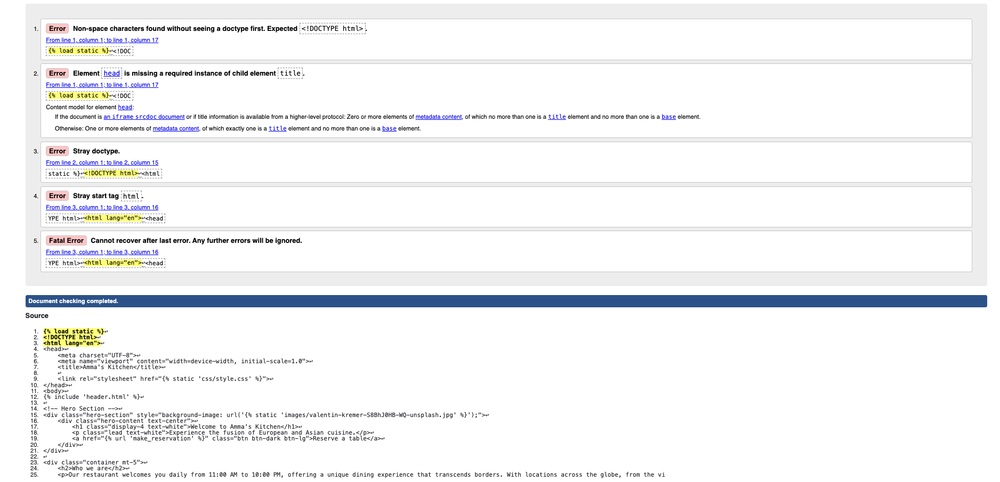

# **Amma Kitchen Testing Documentation**

## **Table of contents**
 - [**HTML Validation**](#html-validation)
 - [**CSS Validation**](#css-validation)
 - [**Python Validation**](#python-validation)

## **HTML Validation**

All HTML code has been run through the [W3C - HTML](https://validator.w3.org/) validator.  The only errors appear to be confusion over the use of Django.

#### **home.html**

#### **reservations.html**

#### **ma_reservation_form.html**

#### **login.html**

#### **register.html**

#### **header.html**

#### **footer.html**

## **CSS Validation**

All CSS code has been run through the [W3C - CSS](https://jigsaw.w3.org/css-validator/) validator.  There was a minor error with text-wrap in style.css, although it does function as intended.

## **Python Validation**

All Python code has been run through the [CI PEP8 Testing](https://pep8ci.herokuapp.com/) validator and has returned no errors, results can be viewed below:

#### **model.py**

#### *views.py**

#### **forms.py**

