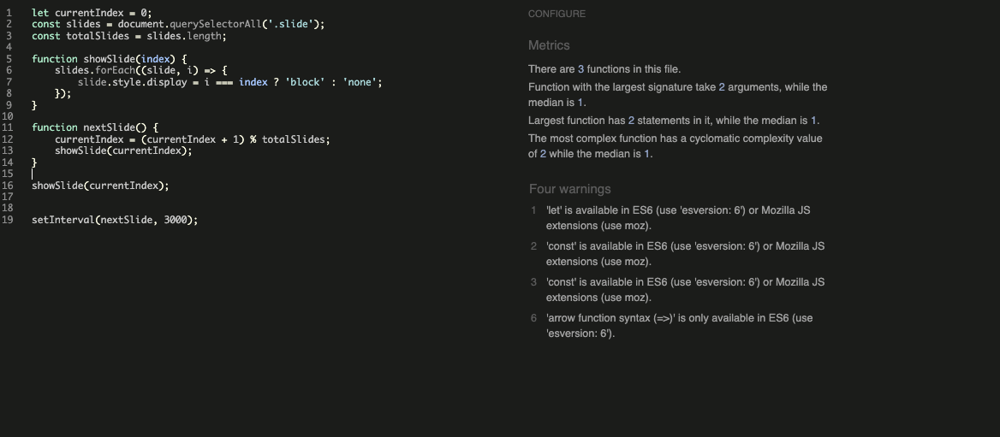

# **Amma Kitchen Testing Documentation**

## **Table of contents**
 - [**HTML Validation**](#html-validation)
 - [**CSS Validation**](#css-validation)
 - [**Python Validation**](#python-validation)

## **HTML Validation**

All HTML code has been run through the [W3C - HTML](https://validator.w3.org/) validator.  The only errors appear to be confusion over the use of Django.

#### **home.html**

#### **reservations.html**

#### **ma_reservation_form.html**

#### **login.html**

#### **register.html**

#### **header.html**

## **CSS Validation**

All CSS code has been run through the [W3C - CSS](https://jigsaw.w3.org/css-validator/) validator.  There was a minor error with text-wrap in style.css, although it does function as intended.

## **JS Validation**

All CSS code has been run through the [JSHINT](https://jshint.com/) validator.  

## **Python Validation**

All Python code has been run through the [CI PEP8 Testing](https://pep8ci.herokuapp.com/) validator and has returned no errors, results can be viewed below:

#### **model.py**

#### **views.py**

#### **forms.py**

## Device Testing

Device testing was conducted on a variety of phone models, including Samsung Galaxy A52, Oppo, iPhone 12, Huawei. The assistance of family members and friends was sought to perform the testing. This comprehensive approach ensured that the website was thoroughly evaluated on different devices and platforms, contributing to a more robust and user-friendly final product.

### Resolved Bugs

#### Problem with deployment on heroku.

* For a long time, deploying my project to Heroku was impossible due to an issue. With the help of a Code Institute tutor, I was able to solve it. The problem turned out to be an incorrect setting in the settings.py file, specifically in the ALLOWED_HOSTS configuration.

### Unresolved Bug

#### Mobil navbar-icon not changed the color

* It's possible that the bug is related to the mobile environment or specific device configurations

#### Double booking is still possible, even though I implemented code to prevent it.

* Bookings can sometimes be duplicated, even though this shouldn't be possible. Despite implementing measures to prevent double bookings, the system occasionally allows them to go through. This issue needs further investigation to ensure that all bookings are correctly handled without overlap

## Features Testing
 
| Page          | User Action   | Expected Result  | Notes            |
|---------------|---------------|------------------|------------------|
| Home Page     |               |                  |                  |
|               | Click on Logo | Redirect to Home Page | PASS        |
|               | Click on Sign Up button | Redirect to Sign Up page | PASS |
|               | Click on Sign Up button (Navigation bar) | Redirect to Sign Up page | PASS |
|               | Click on carousel | Redirect to sign up page | PASS |
|               | Click on carousel control | Move left, move right | PASS |
|               | Click on social links in footer | Open new tab with appropriate link | PASS |
|               | Click on Contact (Navigation bar) | Redirect to Contact page | PASS |
|               | Click on Login (Navigation bar) | Redirect to Login page | PASS |
| Home Page (Logged In - User)  |                 |          |  |
|               | After Login | Sign Up button is now Book Now button | PASS |
|               | Click on Book Now | Redirect to browse cabins | PASS |
|               | Click on carousel | Redirects to browse cabins | PASS |
|               | After Login | Users name is displayed in navigation bar | PASS |
|               | Click on users name | Open dropdown menu | PASS |
|               | Click on My Booking in dropdown | Redirect to Booking Overview page | PASS |
|               | Click on Make a Booking in dropdown | Redirect to browse cabins | PASS |
|               | Click on Logout | Redirect to Logout Page | PASS |
| Sign Up Page  |                  |                  |                  |
|               | Enter invalid email | Field will only accept email address format | PASS |
|               | Enter valid email | No error | PASS |
|               | Email field left empty | Email is optional | PASS |
|               | Type invalid password | Must contain atleast 8 char | PASS |
|               | Type valid password | No error | PASS |
|               | Type password again (different) | Password must be the same | PASS |
|               | Click Sign Up with empty form | Fill in the form fields | PASS |
|               | Click Sign In if you have an account | Redirect to Login page | PASS |
|               | Fill all the form fields | Account created, alert message that you Signed in | PASS |
| Login Page  |                  |                  |                  |
|               | Click on Sign Up, if you don't have an account | Redirect to Sign Up page | PASS |
|               | Try invalid username | Username is not correct | PASS |
|               | Try invalid password | Password is not correct | PASS |
|               | Valid password and username | Logs in, message that you signed in | PASS |
|               | Click Sign In with empty form | Fill in the form fields | PASS |
| Logout Page  |                  |                  |                  |
|               | Click on Sign Out button | Sign user out, message that user signed out | PASS |
| Make a Booking Page  |                  |                  |                  |
|               | Click on Book Now button while form is empty | Fill in the form fields, alert message | PASS |
|               | Try to select dates in the past | They are disabled | PASS |
|               | Try to select already booked dates | They are disabled, unavailable until dates become available is someone deletes their booking         | PASS |
|               | Try to overlap your booking around the already booked dates | Cabins already booked for those dates, alert message | PASS |
|               | Input more guests than maximum guests | Can't exceed maximum guests, alert message | PASS |
|               | Input 0 or less than 0 guests | Guests can't be less than 0, alert message | PASS |
|               | Input more tickets than number of guests | Can't buy more tickets than number of guests | PASS |
|               | Input less than 0 tickets | Can't select less than 0 tickets, alert message | PASS |
|               | Input less than 0 kayaks | Can't select less than 0 kayaks, alert message | PASS |
|               | Input 0 kayaks | kayaks are optional, no error | PASS |
|               | Input 0 tickets | tickets are optional, no error | PASS |
|               | maximum kayak rental is 10 | Anything over 10 throws an error, alert message | PASS |
|               | Try to make check out date be before check in date | Check out can't be before check in, alert message | PASS |
|               | Enter valid form data | Booking Succesful, alert message and a total price is calculated based on the booking | PASS |
|               | User fills in only check in, check out and num of guests | Booking Succesful, amenities are optional | PASS |
| Booking Overview Page |  |    |    |
|               | Read the bookings | Results match users bookings and details of bookings | PASS |
|               | Click on Edit button | Redirect to Edit Booking page | PASS |
|               | Click on Delete button | Redirect to Delete Booking page | PASS |
| Edit Booking Page |  |    |    |
|               | Try to select dates in the past | They are disabled | PASS |
|               | Try to select already booked dates | They are disabled, unavailable until dates become available is someone deletes their booking         | PASS |
|               | Try to overlap your booking around the already booked dates | Cabins already booked for those dates, alert message | PASS |
|               | Input more guests than maximum guests | Can't exceed maximum guests, alert message | PASS |
|               | Input 0 or less than 0 guests | Guests can't be less than 0, alert message | PASS |
|               | Input more tickets than number of guests | Can't buy more tickets than number of guests | PASS |
|               | Input less than 0 tickets | Can't select less than 0 tickets, alert message | PASS |
|               | Input less than 0 kayaks | Can't select less than 0 kayaks, alert message | PASS |
|               | Input 0 kayaks | kayaks are optional, no error | PASS |
|               | Input 0 tickets | tickets are optional, no error | PASS |
|               | maximum kayak rental is 10 | Anything over 10 throws an error, alert message | PASS |
|               | Try to make check out date be before check in date | Check out can't be before check in, alert message | PASS |
|               | Click on Save Changes button | Booking updated succesfully | PASS |
|               | Enter valid form data | Booking succesfully updated, alert message and a total price is calculated based on the booking | PASS |
|               | User fills in only check in, check out and num of guests | Booking succesfully updated, amenities are optional | PASS |
| Delete Booking Page |  |    |    |
|               | Read the booking ID number | It displays correct Id number of chosen cabin user wants to delete | PASS |
|               | Click on Confirm Delete button | Booking is deleted, alert message | PASS |
|               | Click on Cancel button | Redirect back to Booking Overview page | PASS |
| Admin Panel |  |    |    |
|               | CRUD functionality | Working as expected | PASS |

